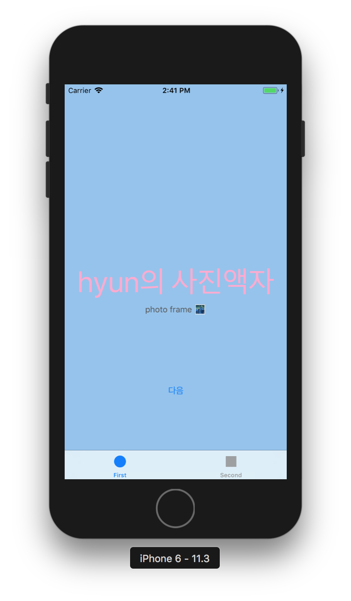
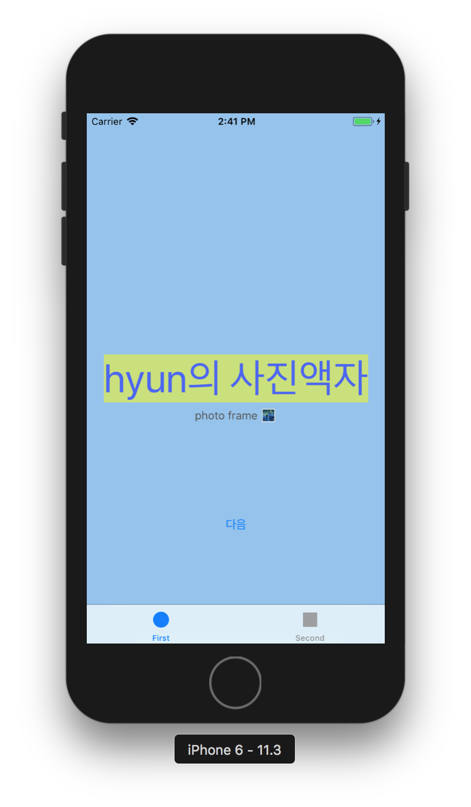
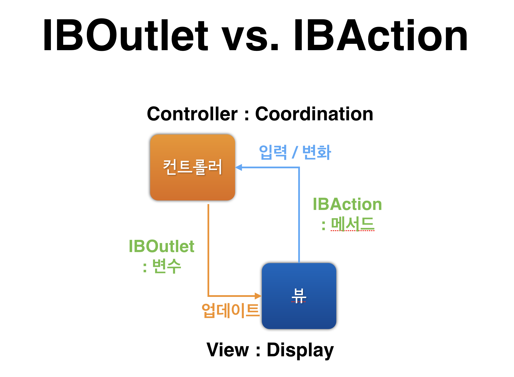
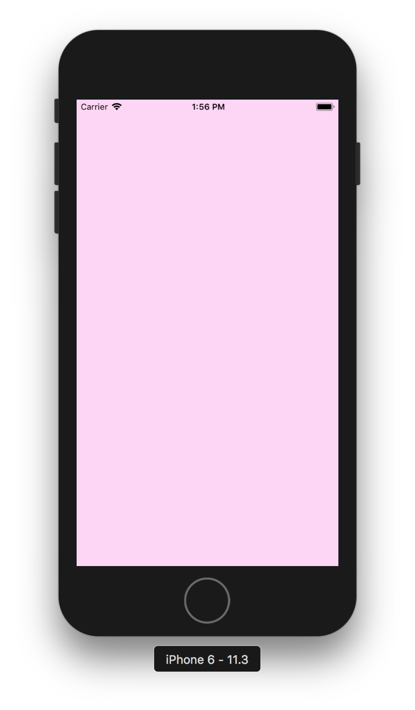
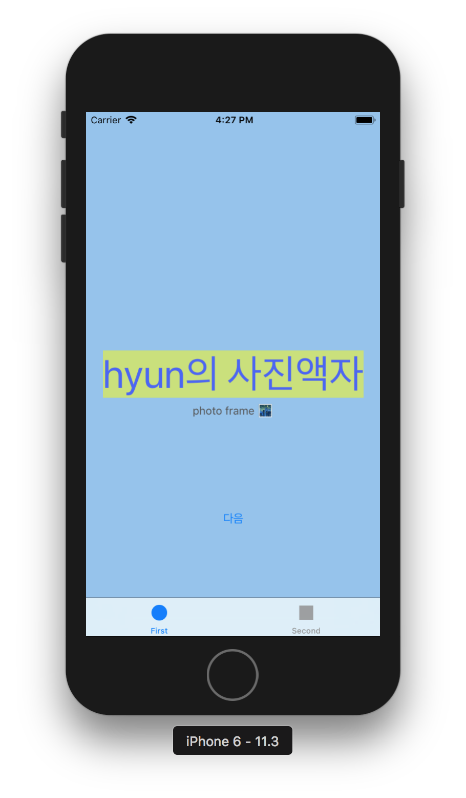
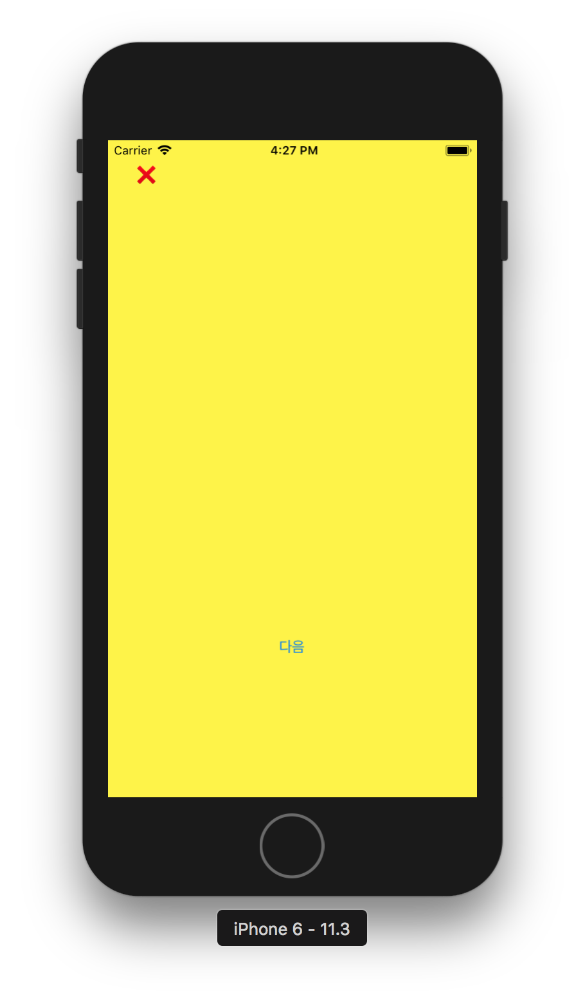
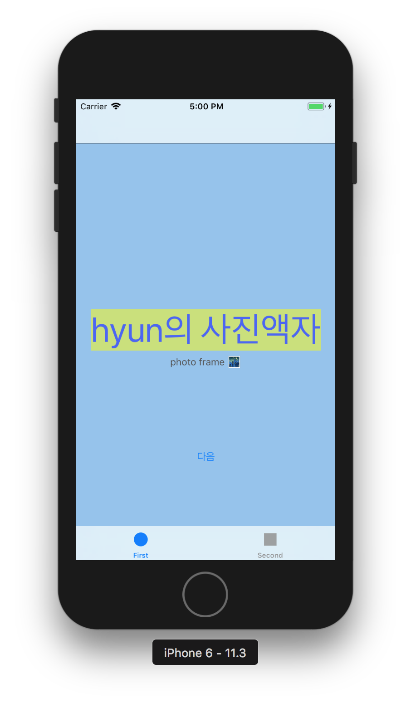
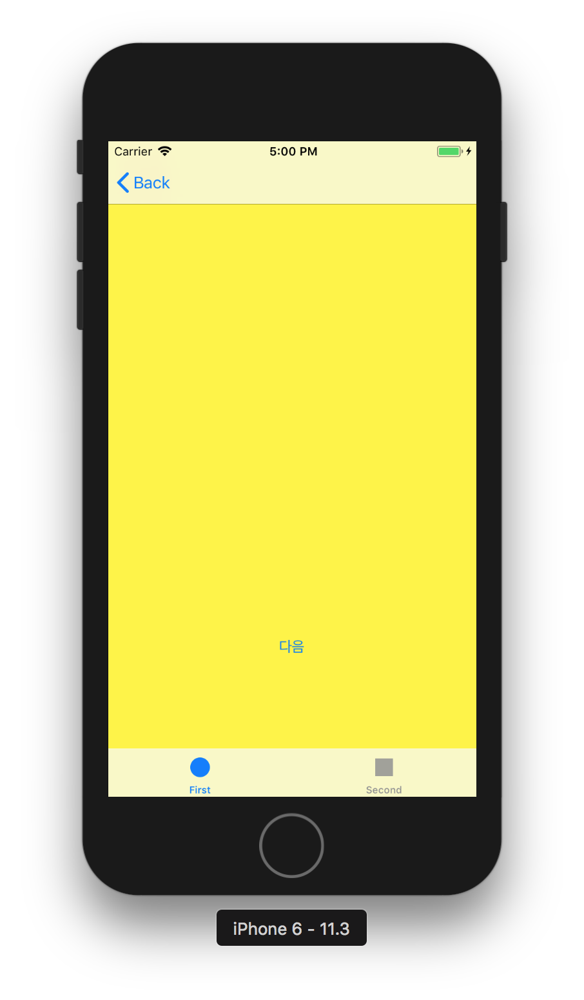
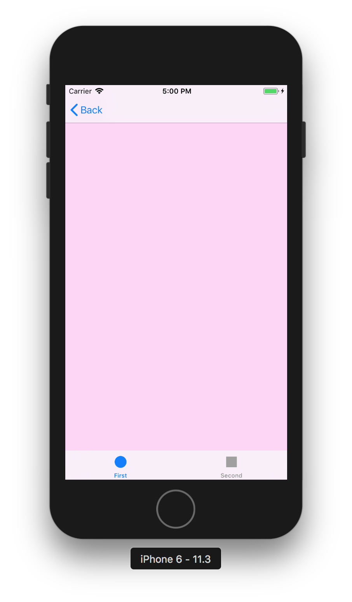

## PhotoFrame - step1

### 프로그래밍 요구사항

자동 생성된 ViewController 클래스 viewDidLoad() 함수에서 print(#file, #line, #function, #column) 코드를 추가하고 실행하면 콘솔 영역에 무엇이 출력되는지 확인한다.

### 콘솔 화면

* 애플 UIKit View Management 클래스 중에서 UITabBarController 와 UITabBar에 대해 학습한다.
	* 각 클래스 역할은 무엇인가? 어떤 경우에 사용하나?
	* UITabBar와 UITabBarController의 차이점은 무엇인가?
	* 관련 클래스는 무엇이 있나?

* UITabBar  
일반적으로 화면의 아랫부분에 위치하며 여러 다른 내용의 뷰를 사용자들이 선택할 수 있도록 문자열과 부가적인 아이콘들을 표시한다.
탭 바는 수평적 화면 이동을 제공하는 인터페이스이다. 내비게이션 바가 수직적 화면 이동에 사용되는 것과 달리, 동등한 수준의
여러 화면으로 이동할 때 사용된다. 탭 바 내부에 나열된 각각의 탭들은 터치했을 때 그에 연결된 화면으로 이동함을 의미한다. 
탭바의 탭은 일반적으로 5개 미만으로만 사용하는 것이 적절한데, 그 이상 늘어나면 사용자가 터치할 충분한 공간 확보가
어렵기 때문이다. 만약 그 이상으로 늘어나야 한다면 탭 바 대신 다른 인터페이스를 사용하거나 또는 더보기 방식으로 나머지
메뉴를 숨김 처리하는 것이 좋다.
탭바는 탭 바 컨트롤러를 통해 다루는 것이 좋다.

* UITabBarController  
선택된 탭 항목에 따라 표시할 뷰를 결정하는 컨테이너 컨트롤러이다.

#### 참고링크  
[UITabBarController](https://developer.apple.com/documentation/uikit/uitabbarcontroller)   
[UITabBar](https://developer.apple.com/documentation/uikit/uitabbar)

  
      

## PhotoFrame - step2

### 요구사항  
* 사진액자 앱 - 시작하기 요구사항을 구현한 상태로 시작한다.
* First Scene에 만들어져 있는 레이블을 IBOutlet으로 연결한다.
* 연결한 아웃렛 변수에 값을 변경한다.
* 실행한 화면을 캡처해서 readme.md 파일에 포함한다.
  
### 프로그래밍 요구사항
* Xcode 프로젝트 내비게이터에서 Main.storyboard 파일을 선택하고 First Scene 에 있는 'First View' 레이블(Label)을 선택하고 Assistant Editor 모드로 변경한다.
* 레이블을 선택하고 Control + 드래그해서 ViewController 코드에 IBOutlet으로 연결한다.
* Outlet 이름으로 photoLabel을 입력한다.
* ViewController 클래스 viewDidLoad() 함수에서 위에 추가한 아웃렛 변수에 값을 변경하고 다시 실행한다.
* 위와 같이 코드로 firstLabel의 속성을 변경해본다. 글자색, 배경색, 투명도, 글자 크기를 바꿔본다.
* firstLabel 아래 있는 레이블도 firstDescription 아웃렛으로 연결한다.
	* 마찬가지 방식으로 값을 변경해서 꾸며본다.

  

* UILabel 클래스 속성(Property)는 어떤게 있는지 학습한다.

### UILabel  
text - Label 내용을 지정  
textColor - text color를 지정  
font - 문자열의 글꼴을 지정  
textAlignment - 문자의 가로정렬 왼쪽, 오른쪽, 가운데정렬 선택  
numberOfLines - 문자를 렌더링할때 최대 line 수를 지정 

#### 참고링크  
[UILabel](https://developer.apple.com/documentation/uikit/uilabel)  
[RGB to UIColor Converter](http://uicolor.xyz/#/rgb-to-ui)  

## PhotoFrame - step3  
  
### 요구사항    
* 사진액자 - IBOutlet 요구사항을 구현한 상태로 시작한다.
* First Scene에 버튼(UIButton)을 추가하고 IBAction으로 연결한다.
* 연결한 액션에 대한 메서드를 구현한다.
* 실행하고 버튼을 터치하기 이전/이후 화면을 캡처해서 readme.md 파일에 포함한다.  

### 프로그래밍 요구사항  
* Main.storyboard 에서 First Scene에 UIButton을 추가한다.
	* 우측 유틸리티 영역 하단 3번째 탭 - 객체 라이브러리(Object Library)에서 Button 을 찾아서 View로 드래그한다.
	* 방금 추가한 버튼을 선택하고 우측 유틸리티 영역 상단 4번째 탭 - 속성(Attributes)에서 Title을 `다음`으로 변경한다.
* 버튼을 선택하고 `Control + 드래그`해서 ViewController 코드에 IBAction으로 연결한다. 
* 다음과 팝업에서 Connection 항목에서 IBOutlet 대신 IBAction 으로 변경한다.
* 액션 이름을 `nextButtonTouched` 로 지정한다.
* ViewController 클래스에 추가된 nextButtonTouched() 메서드에 아래처럼 구현을 추가한다.   

### 학습꺼리
* IBAction 과 IBOutlet 연결 구조에 대해 이해한 내용을 정리한다.  

  

  
IBAction과 IBOutlet은 iOS 프로그래밍에서 MVC 패턴을 구현하기 위한 개념으로 사용된다

MVC 패턴이란 데이터를 소유한 Model과 사용자에게 보여지는 View 그리고 View에서 발생되는 Event를 받아서 Model을 갱신하는 Controller를 의미하는데 View와 ViewController를 연결해주는 역할을 하는 것이 IBAction과 IBOutlet이다

MVC(Model View Controller)의 약자로 에플리케이션을 세가지의 역할로 구분한 개발 방법론이다. 아래의 그림처럼 사용자가 Controller를 조작하면 Controller는 Model을 통해서 데이터를 가져오고 그 정보를 바탕으로 시각적인 표현을 담당하는 View를 제어해서 사용자에게 전달하게 된다. 

  

IBAction은 View에서 Event가 발생되었을 때 호출되는 함수이며 IBOutlet은 Controller 함수에서 Button 등 View의 Control에 접근하기 위한 변수이다  

* 버튼에 IBAction을 추가할 때 이벤트(Event) 종류에는 어떤 것들이 있는지 학습한다.  

  

* 버튼에 액션을 여러개 추가할 수 있을까?
	* 버튼에 액션을 여러개 추가할 수 있다
	* sender를 이용해서 구분해서 사용할수 있다
* 버튼이 여러개일 때 하나의 액션에 추가할 수 있을까?
	*  여러개의 버튼에 하나의 액션을 추가할 수 있다

#### 참고링크    
[IBAction과 IBOutlet](http://blog.devez.net/59)  
[MVC 생활코딩](https://opentutorials.org/course/697/3828)  
[UIButton](https://developer.apple.com/documentation/uikit/uibutton)  
[UIControl](https://developer.apple.com/documentation/uikit/uicontrol?changes=latest_minor&preferredLanguage=occ)  
[iOS IBAction](https://m.blog.naver.com/PostView.nhn?blogId=itperson&logNo=220972510635&proxyReferer=https%3A%2F%2Fwww.google.co.kr%2F)  

## PhotoFrame - step4  

### 요구사항      

* 사진액자 - IBAction 요구사항을 구현한 상태로 시작한다.
* 스토리보드 구성 요소에 대해 학습하고 새로운 Scene과 Segue를 추가한다.
* 실행하고 새로운 화면을 캡처해서 readme.md 파일에 포함한다.  

### 프로그래밍 요구사항  

* Main 스토리보드에서 First Scene 옆에 ViewController를 드래그해서 새로운 Scene을 추가한다.
* 앞 단계에서 추가한 [다음]버튼을 선택하고 Control + 드래그를 해서 새로 추가한 Scene에 연결한다.
	* 팝업으로 표시되는 Action Segue에서 `Show` 항목을 선택한다.
* Scene과 Scene 사이에 화살표를 선택하면 Segue 속성을 변경할 수 있다  
* 새로 추가한 Scene 속성에서 배경 색상(Background Color)을 원하는 색상으로 변경한다. 새로 앱을 실행해보고 [다음] 버튼을 누르면 새로운 화면이 나타나는지 확인한다.
* 다시 스토리보드에서 위에 추가한 Scene (혹은 ViewController)에 [다음] 버튼을 추가한다. 우측 옆에 한 단계 더 표현하기 위한 ViewController를 추가하고 배경 색상을 다른 색상으로 변경한다. 위와 마찬가지로 [다음]버튼에서 새 Scene으로 Segue를 연결한다. 
	* 예를 들어 First Scene 다음에 추가한 화면이 Yellow 화면이었다면, First Scene에서 [다음] 버튼을 누르면 Yellow 화면이 표시되고, Yellow 화면에서 [다음] 버튼을 누르면 Blue 화면이 나오는 방식으로 두 단계 표시한다.   

### 학습꺼리  
* Segue에 액션에 있는 여러 항목들은 어떤 효과가 있는지 값을 바꿔보며 실행해서 학습한다.     

Segue   
화면 전환
어떤 버튼을 눌렀을 때 다른 화면으로 넘어가는 것을 세그웨이라고 한다.

Segue의 종류  

* Show - 가장 일반적인 세그웨이. 새 Scene으로 이동한다. Stack 구조로서 새 화면이 원래 화면 위를 덮는 구조이다.
* Show Detail - SplitView 구조에서 원래 화면을 Master 새 화면을 Detail로 표시한다. iPad만 해당되며 화면이 둘로 분활되서 보인다
* Present Modally - 새 화면이 모달처럼 원래 화면 전체를 뒤덮는다. 원래 화면은 새 화면 뒤에 그대로 존재한다.
* PoPover Presentation - iPad에서 팝업창을 띄운다. 
* Custom - 사용자 정의 세그웨이를 만든다. 

#### 참고링크      
[Segue](http://blog.naver.com/PostView.nhn?blogId=jdub7138&logNo=220393890771&parentCategoryNo=58&categoryNo=&viewDate=&isShowPopularPosts=true&from=search)

## PhotoFrame - step5 
 
### 요구사항        
* 사진액자 - Scene과 Segue 요구사항을 구현한 상태로 시작한다.
* 뷰컨트롤러 강의 슬라이드를 읽고 학습한다.
* 스토리보드 구성 요소와 클래스 코드와 연결해서 동작을 확장한다.
* 실행하고 새로운 화면을 캡처해서 readme.md 파일에 포함한다.  

### 프로그래밍 요구사항  
* 프로젝트에 새로운 ViewController 클래스를 추가한다. File > New... > File... 메뉴를 선택한다. 다음과 같은 화면에서 Cocoa Touch Class를 선택한다.
* 다음과 같이 UIViewController에서 상속받도록 입력하고, 원하는 클래스명을 입력한다. (예시 YellowViewController)  
* 다음 화면에서는 프로젝트내 어떤 경로에 저장하며, 프로젝트 그룹/타깃에 저장할 것인지 선택한다.  
	* 하위 디렉토리가 있거나 원하는 하위 그룹이 있으면 변경할 수 있다.
	* 빌드하는 타깃이 여러 개인 경우, 복수로 선택할 수도 있다. 

* 스토리보드에서 새로 추가한 Scene을 선택하고, 우측 유틸리티 영역 3번째 Identity 탭을 선택한다.  
	* Custom Class > Class 항목에 YellowViewController (자신이 생성한 클래스 이름)을 지정한다.
	* 자동완성이 되야 클래스가 제대로 생성된 것이다. 자동완성이 안된다면 앞 단계를 다시 확인해서 UIViewController에서 상속 받도록 만들었는지 확인하고 클래스를 다시 만든다.
* 이제 스토리보드에서 YellowViewController 화면에 [닫기] 버튼을 추가한다.
* Assistant Editor를 선택하고 [닫기] 버튼에 대한 IBAction 액션을 연결한다.
	* 만약 방금 추가한 `YellowViewController` (혹은 자신이 생성한 클래스)가 우측에 자동으로 연결되지 않으면 Custom Class가 정상적으로 연결되지 않았거나

	* 우측 Assistant 편집기 상단에 점프바(JumpBar)에 `Automatic` 이라고 선택되어 있는지 확인한다. 다른 상태인 경우 `Automatic`으로 변경한다.
* IBAction 이름은 `closeButtonTouched`로 지정하고 다음과 같이 코드를 작성한다.

* 위와 동일하게 세 번째 추가한 화면에 대해 ViewController 클래스를 지정하고, [닫기]버튼을 추가하고, 액션을 연결해서 화면을 닫는 동작이 동작하도록 구현한다.
* 뷰 컨트롤러 강의 자료에 있는 화면 관련 콜백 함수들에 모두 `print(#file, #line, #function, #column)` 코드를 추가한다.
	* viewWillAppear()
	* viewDidAppear()
	* viewWillDisappear()
	* viewDidDisappear()

### 학습꺼리    
* 화면 전환이 이루어지는 사이에 뷰컨트롤러 라이프사이클이 어떻게 변화하는지 학습한다.
* 뷰컨트롤러와 관련된 새로운 용어들에 대해 학습한다.
* YellowViewController에서 Segue를 제거하고 다음 화면을 보여줄 때 코드로 보여주는 방법을 찾아보고 적용해본다.

#### 참고링크      
[Swift 화면 전환](http://blog.naver.com/PostView.nhn?blogId=baek2304&logNo=220885876605&parentCategoryNo=68&categoryNo=&viewDate=&isShowPopularPosts=true&from=search)  
[화면 전환](http://mytoygift.com/152)  

## PhotoFrame - step6

### 요구사항  
* 사진액자 - ViewController 요구사항을 구현한 상태로 시작한다.
* 뷰컨트롤러 컨테이너 강의 슬라이드를 읽고 학습한다.
* 내비게이션 컨트롤러(Navigation Controller)를 Embed 시켜서 동작하도록 개선한다.
* 실행하고 새로운 화면을 캡처해서 readme.md 파일에 포함한다.  

### 프로그래밍 요구사항    
* 스토리보드에서 First Scene을 선택하고, Editor > Embed In > Navigation Controller 항목을 선택한다.
* 실행해보면 화면 상단에 내비게이션바(Navigation Bar)가 추가되고 [다음]버튼을 누르면 다음 화면이 우측에서 좌측으로 애니메이션되면서 표시된다.
* [닫기]버튼에 연결된 `loseButtonTouched` 코드를 다음과 같이 수정한다.
* 위와 동일하게 세 번째 추가한 화면에 [닫기]버튼도 코드를 수정한다.
* 뷰 컨트롤러 콜백 함수들 동작도 동일한지 확인한다.

  
  
  

### 학습꺼리  
* 뷰컨트롤러 컨테이너 동작을 이해한다.
* 뷰컨트롤러 컨테이너는 또 어떤 클래스가 있는지 찾아보고 학습한다.  
UINavigationController, UISplitViewController(아이패드 한정), UITabBarController
* 내비게이션 컨트롤러가 있을 경우와 없을 경우 화면 전환 동작이 어떻게 다른지, 화면들 포함관계가 있는지 학습한다.
	내비게이션 컨트롤러를 적용할 경우 우측에서 화면이 들어오면서 전환이 되고,
적용 하지 않을 경우 하단에서 화면이 들어오면서 전환 된다 

* 내비게이션 컨트롤러 관련 메서드가 왜 push / pop 인지 학습한다.  
 화면 전환이 발생하는 뷰 컨트롤러들의 포인터를 스택(Stack)으로 관리하여 원하는 화면에 접근하기 쉽게 한다. 내비게이션 컨트롤러는 뷰 컨트롤러들의 계층적 구조를 관리하는 역할이기 때문에, 직접 콘텐츠를 담고 화면을 구성하지는 않는 대신 다른 뷰 컨트롤러들을 포함하고 있다. 스토리보드에서 보이는 것과 다르게 독립된 자신만의 화면을 가지지 않는 대신 이 컨트롤러가 제어하는 모든 뷰 컨트롤러에 내비게이션 바를 생성하는 특징 (내비게이션 바를 통해 넘어가거나 show 방식으로 넘어갈 경우에 내비게이션이 생성됨) 이 있다.  
 최상위 뷰 컨트롤러는 화면에 표시되므로, 스택의 최상위 뷰 컨트롤러를 더하거나 빼는 것은 화면을 전환하는 것과 같다. 따라서 관련 메서드 네이밍도 pop/push 로 뷰를 관리한다.
	* 다른 뷰 컨트롤러 호출 메소드 pushViewController(_:animated:)  
	* 이전의 뷰 컨트롤러로 되돌아가는 메소드popViewController(_:animated:)

[[출처] Swift 화면 전환 기법](http://blog.naver.com/PostView.nhn?blogId=baek2304&logNo=220885876605&parentCategoryNo=68&categoryNo=&viewDate=&isShowPopularPosts=true&from=search)

